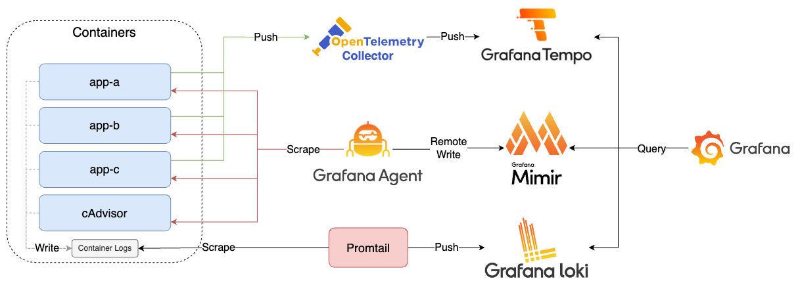
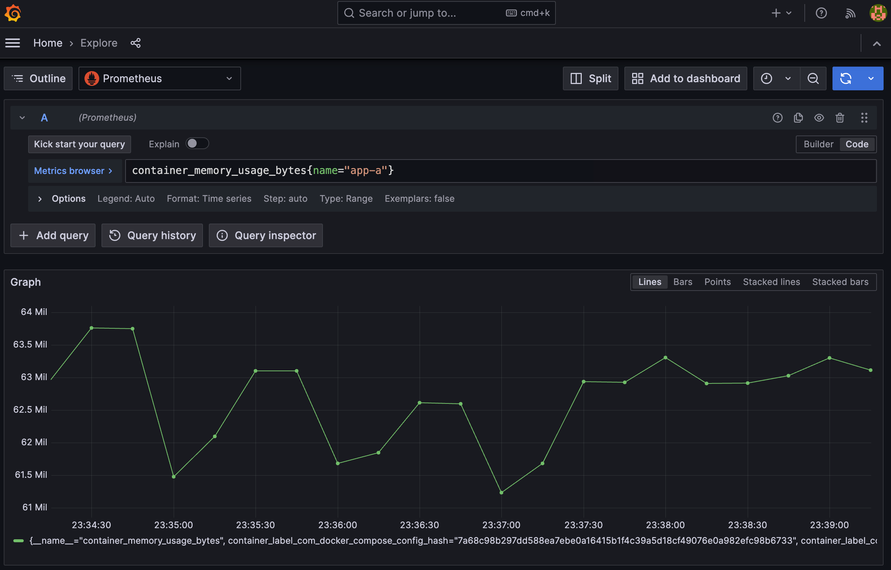
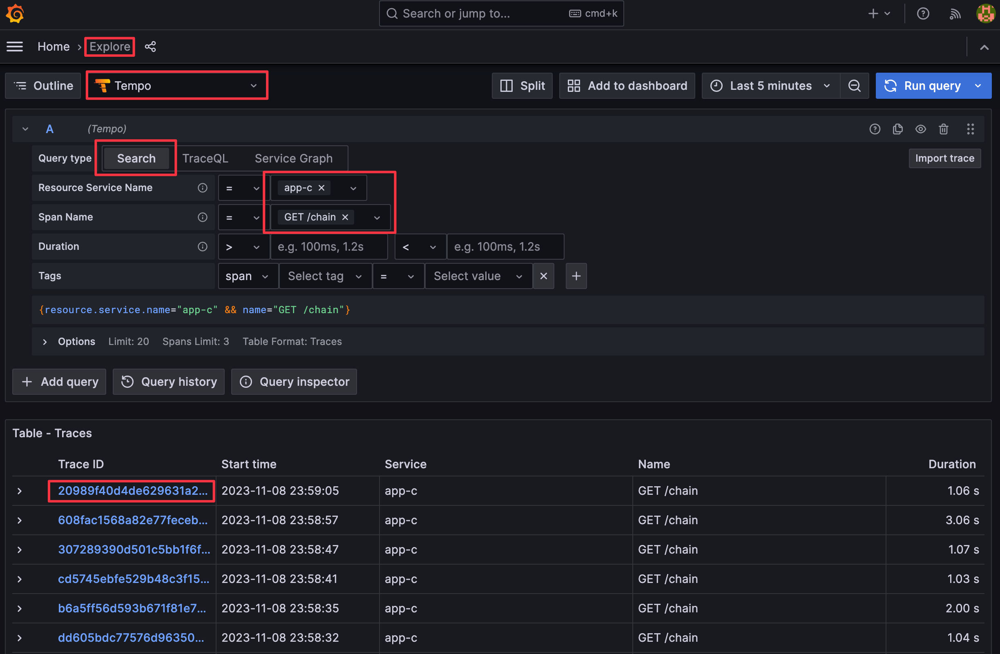
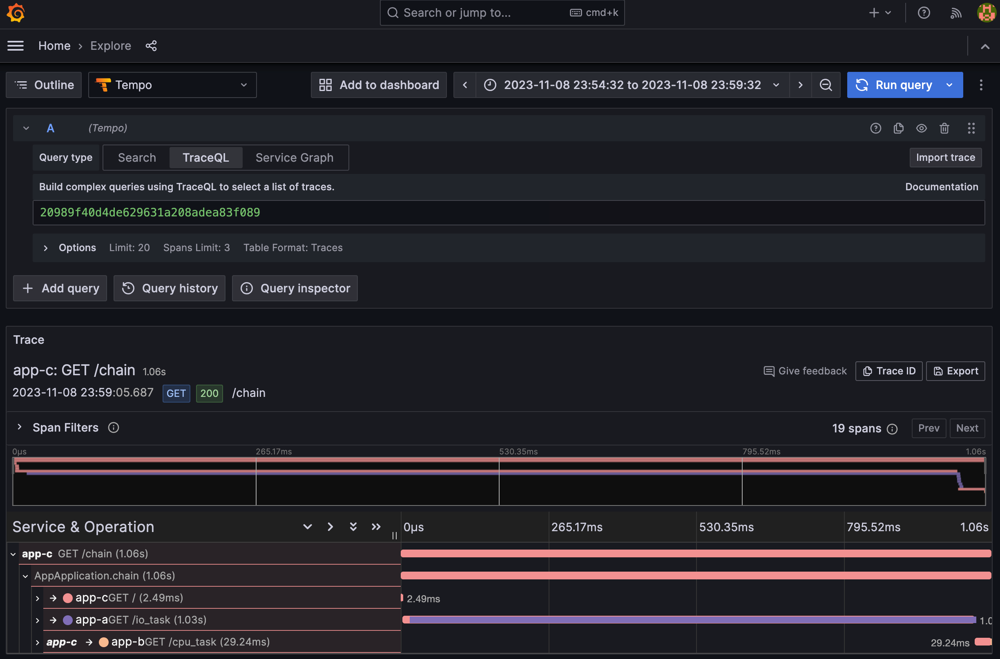

# Lab 1



## Quick Start

1. Start all services

    ```bash
    docker-compose up -d
    ```

2. View services
   1. App A: [http://localhost:8000](http://localhost:8000)
      1. Swagger UI: [http://localhost:8000/docs](http://localhost:8000/docs)
      2. Metrics: [http://localhost:8000/metrics](http://localhost:8000/metrics)
   2. App B: [http://localhost:8001](http://localhost:8001)
      1. Swagger UI: [http://localhost:8001/docs](http://localhost:8001/docs)
      2. Metrics: [http://localhost:8001/metrics](http://localhost:8001/metrics)
   3. App C: [http://localhost:8080](http://localhost:8082)
      1. Swagger UI: [http://localhost:8080/swagger-ui/index.html](http://localhost:8080/swagger-ui/index.html)
      2. Metrics: [http://localhost:8080/actuator/prometheus](http://localhost:8080/actuator/prometheus)
   4. cAdvisor: [http://localhost:8081](http://localhost:8081)
   5. Grafana Agent: [http://localhost:12345](http://localhost:12345)
   6. Grafana: [http://localhost:3000](http://localhost:3000), login credentials are `admin/admin`
      1. Click Menu in top left > Dashboards > Cadvisor exporter, FastAPI Observability, Spring Boot Observability to view the dashboards created through Provisioning

3. Stop all services

    ```bash
    docker-compose down
    ```

## Goals


1. Create FastAPI Apps (app-a, app-b)
   1. Generate OpenMetrics using Prometheus Client, exposed at `/metrics` endpoint
   2. Generate Traces using OpenTelemetry Manual Instrumentation, sent to OpenTelemetry Collector
   3. Write Trace ID and Span ID to logs using OpenTelemetry Manual Instrumentation and Log Pattern adjustment
2. Create Spring Boot App (app-c)
   1. Generate OpenMetrics using Spring Boot Actuator and Micrometer, exposed at `/actuator/prometheus` endpoint
   2. Generate Traces using OpenTelemetry Automatic Instrumentation, sent to OpenTelemetry Collector
   3. Write Trace ID and Span ID to logs using OpenTelemetry Automatic Instrumentation and Log Pattern adjustment
3. Set up cAdvisor to monitor Docker Containers, Prometheus Metrics exposed at `/metrics` endpoint
4. Set up Grafana Agent to collect metrics from app-a, app-b, app-c, cAdvisor, and forward them to Mimir for storage
5. Set up Mimir to receive metrics collected by Prometheus
6. Set up Promtail to collect Container Logs and send them to Loki
7. Set up Loki to receive logs collected by Promtail
8. Set up OpenTelemetry Collector to receive traces from App A, App B, App C, and forward them to Tempo
9. Set up Tempo to receive traces from App A, App B, App C
10. Set up Grafana to query data from Mimir, Loki, and Tempo

## Tasks

<details><summary>Task 1: Use PromQL syntax in Grafana to query app-a's container memory usage, verifying that Grafana Agent is scraping metrics and writing to Mimir</summary>

1. Open Grafana UI, click the left menu and go to `Explore` tab, select `Prometheus` from the top-left dropdown menu and enter the following query

    ```promql
    container_memory_usage_bytes{name="app-a"}
    ```

    

</details>

<details><summary>Task 2: After opening <a href="http://localhost:8080/chain" target="_blank">http://localhost:8080/chain</a>, query the trace for that App C request to verify that OpenTelemetry Collector received and forwarded the trace to Tempo</summary>

1. Open Grafana UI, click the left menu and go to `Explore` tab
2. Select `Tempo` from the top-left dropdown menu, choose `Search` as Query Type, select `app-c` for `Resource Service Name`, select `GET /chain` for `Span Name` and click `Run Query`





</details>
